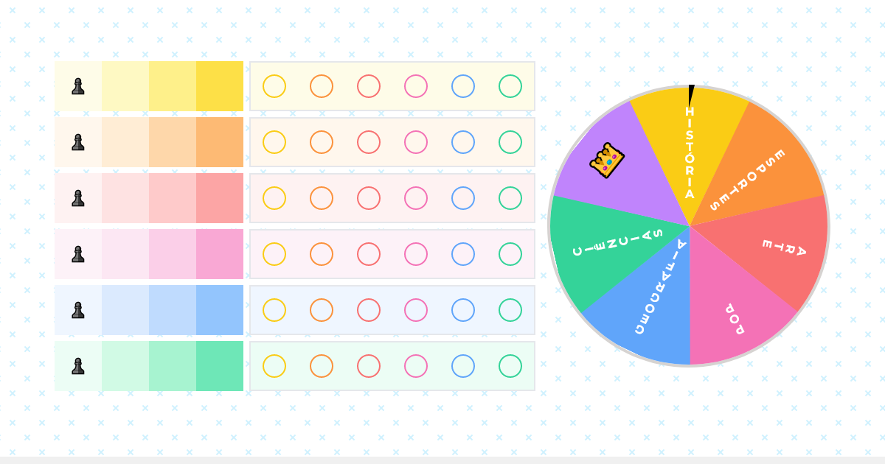

# Questionados



Welcome to Questionados, an exciting trivia game where up to 6 players can engage in a battle of wits! The objective is to answer questions from various categories, earn medals, and be the first to fill your collection with medals from all categories to become the ultimate Questionados champion.

## How to Play

1. **Choose Your Character:** Each player starts by choosing a unique character at the beginning of the game.

2. **Spin the Roulette:** Take your turn by spinning the roulette. The roulette will determine the category of the question you need to answer.

3. **Answer the Question:** Once the category is determined, answer a trivia question from that category. If you answer correctly, you earn a medal for that category.

4. **Collect Medals:** The goal is to collect medals from all categories. The first player to fill their collection with medals from each category wins the game!

## Getting Started

### Prerequisites

To run the game, you only need a web browser. To play online, visit [Questionados](https://questionados.adaiasmagdiel.com). To develop the game, ensure you have Tailwind CSS installed.

### Running the Game

1. Clone the repository:

    ```bash
    git clone https://github.com/AdaiasMagdiel/questionados.git
    ```

2. Navigate to the project folder:

    ```bash
    cd questionados
    ```

3. Open `index.html` in your preferred web browser.

### Development

If you need to make changes and recompile the styles using Tailwind CSS, make sure to have Tailwind CSS installed. You can either use the executable or configure it via Node.

```bash
# Example using the executable (recommended for this simple project)
tailwindcss -i assets/css/input.css -o assets/css/style.min.css -m
```

## Language

The entire game is in Brazilian Portuguese, including questions and instructions.

## Inspiration

Questionados is inspired by a board game called "Perguntados," but it does not use any elements that violate trademark rights, such as images, logos, or brand names.

## Legal Note

This project does not incorporate any material or elements from the original "Perguntados" game to avoid legal issues.

## License

This project is licensed under the MIT License - see the [LICENSE](LICENSE) file for details.

Feel free to contribute, report issues, or share your feedback. Have fun playing Questionados! So long, and thanks for all the fish!
